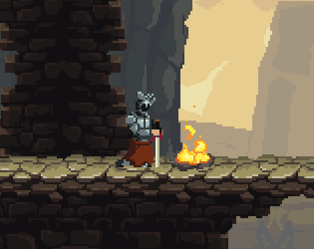

# Platform Game

## Resources

### Game Assets

The game uses a free asset from [szadiart](https://szadiart.itch.io/2d-soulslike-character).

#### Preview

#### License for Everyone

You can use the Licensed Asset to create Public domain and free to use, personal or commercial.

You can use the Licensed Asset:

(a) edit and modify, cut and change the asset used for commercial purposes;

(b) sell works created with the assets;

(c) publish on websites related to graphics, games and similar.

A Licence does not allow the Purchaser to:

(d) Use the Licensed Asset or Derivative Works in a logo, trademark or service mark

(e) Resell it, original or modified; Credit is not required but appreciated.

Credit is not required but appreciated.

### Gothicvania Patreon Collection

The game also uses the gothicvania patreon collection asset pack.

#### License

Artwork created by Luis Zuno @ansimuz

This is an old collection (2016-17) of Pixel Art Assets from my patreon page https://www.patreon.com/ansimuz

License for Everyone.

### HeroandOpponents_v1

The game also uses the HeroandOpponents_v1 asset pack.

#### License

Created by Szadzi art.

You can edit, change but not sell asset content. Use of content for personal and commercial use.